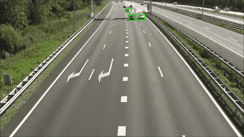

# Simple Object Tracker in Python
The **Simple Object Tracker** is a Python project that utilizes Kalman Filter for tracking detected objects in video streams.
<p align="center">
  <a href="https://github.com/amirhosein-vedadi/simple_object_tracking">
    
  </a>
</p>

## Installation

To install the Simple Object Tracker, follow these steps:

   ```bash
   git clone https://github.com/amirhosein-vedadi/simple_object_tracking.git
   
   cd simple_object_tracking

   pip install -e .
   ```
## Usage

To demonstrate how to use the Simple Object Tracker, an example script is provided in the examples directory. The example script initializes the YOLO model and the tracker, processes each frame of the video, displays the tracking results and saves the output video.
1. Ensure that you have a video file (e.g., traffic.mp4) in the `data/videos` directory.
2. Place your YOLO model weights (e.g., yolov8s.pt) in the `data/weights` directory.
3. Run the example script:
```bash
python examples/yolo_tracker.py
```